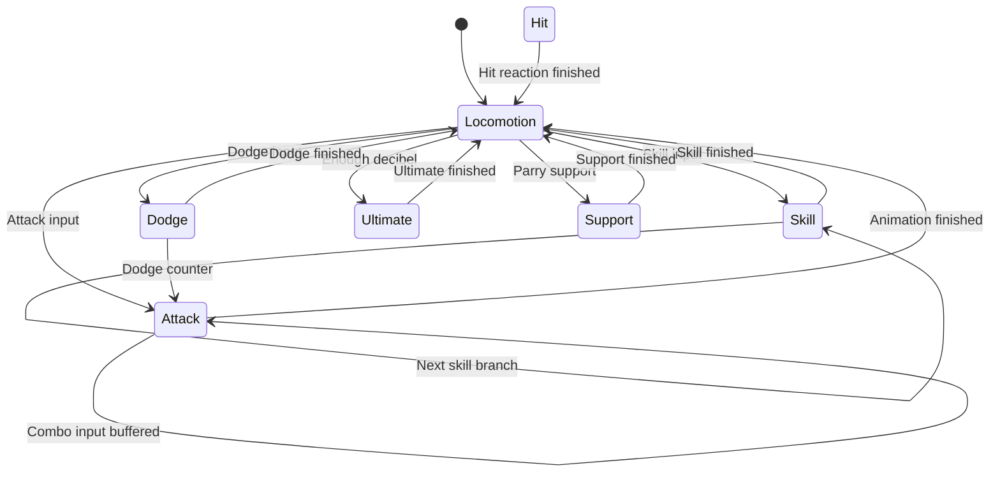
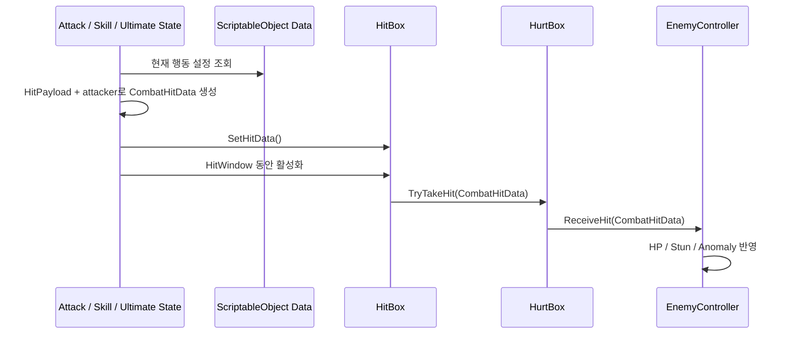

# Architecture

## 전체 책임 분리

| 소유자 | 보유하는 상태 | 맡는 일 | 알지 않아도 되는 것 |
| --- | --- | --- | --- |
| `PlayerController` | 현재 상태, 체력·에너지·데시벨, 캐릭터 데이터 | 입력 전달, 상태 교체, 전투 자원 제공 | UI 배치와 게이지 연출 |
| `IPlayerState` 구현 | 행동별 단계와 경과 시간 | 이동·공격·회피·스킬·궁극기 규칙 | 다른 캐릭터의 UI |
| `AttackData` / `SkillData` / `UltimateData` | 애니메이션명, 이동값, HitWindow, HitPayload | 캐릭터별 행동 설정 | 실제 공격자와 피격 대상 |
| `HitBox` | 현재 활성 여부와 `CombatHitData` | 충돌 대상을 찾아 공격 전달 | HP·그로기 계산 방식 |
| `HurtBox` | 플레이어 또는 적 소유자 | 피격 대상을 판별해 올바른 수신자 호출 | 공격 상태의 진행 방식 |
| `EnemyController` | HP, 그로기, 이상 축적, 공격 단계 | 적의 공격과 피격 결과 처리 | 플레이어 HUD 구성 |
| `PartyManager` | 파티원과 활성 캐릭터 | 교대와 지원 행동 흐름 | 각 상태의 내부 타이밍 |
| UI 컴포넌트 | 표시 대상과 보간 중인 값 | 전투 상태를 화면에 표현 | 대미지·자원 소비 규칙 |

## 플레이어 상태 흐름

`PlayerController.ChangeState()`가 `Exit → Enter` 순서를 보장하고, 프레임 입력은 현재 상태의 `Handle...()` 메서드로 전달됩니다. 상태 구현은 자신이 사용하는 데이터와 행동 단계만 보유합니다.

## 공격 데이터 흐름

### 데이터 분리 이유

- `HitPayload`: 에셋에 저장할 수 있는 정적 공격 속성
- `CombatHitData`: 공격 순간의 실제 공격자까지 포함한 런타임 값
- `HitWindow`: 한 애니메이션에서 HitBox가 활성화되는 정규화 시간 범위

같은 공격 데이터를 여러 캐릭터나 프리팹에서 재사용하더라도 공격자별 능력치는 충돌 순간에 올바르게 계산됩니다.

## 적 전투 흐름

`EnemyController`는 공격 데이터 배열에서 패턴을 선택하고 애니메이션 정규화 시간으로 다음 구간을 처리합니다.

1. 공격 시작과 경고 구간 설정
2. Active 구간에 적 HitBox 활성화
3. 패링 가능 여부와 지원 포인트에 따라 노란색·빨간색 경고 결정
4. 피격 시 HP, 그로기와 속성 이상 게이지 누적
5. 그로기 진입 시 공격 중단과 대미지 배율 적용
6. 조건이 맞으면 `ChainSkillRequested` 이벤트 발행

UI는 이 이벤트와 적의 정규화 값을 구독하거나 조회할 뿐, 적의 전투 규칙에는 관여하지 않습니다.

## UI 흐름

- `PlayerStatusUI`: 현재 플레이어의 HP와 에너지 표시
- `PartyStatusUI`: 활성·대기 파티원의 초상화, HP와 자원 표시
- `EnemyStatusUI`: 적 HP, 그로기와 이상 속성 표시
- `EnemyWorldStatusUI`: 월드 좌표의 적 상태 UI 추적
- `ChainSkillPromptUI`: 연쇄 스킬 요청 이벤트와 제한 시간 표시
- `AnimatedGaugeUI`: 즉시 게이지와 지연 게이지의 보간 표현

전투 시스템은 `Image`, 텍스트 배치와 애니메이션을 모르며, UI 교체가 전투 로직 변경으로 이어지지 않도록 구성했습니다.

## Editor 자동화

`Assets/Editor`에는 다음 반복 작업을 줄이는 코드가 포함됩니다.

- 캐릭터 프리셋 검증
- 캐릭터 프리팹과 데이터 팩 생성
- 애니메이션 클립 자동 탐색과 연결
- 특정 캐릭터 모델 임포트 규칙 적용
- 전투 HUD 프리팹과 데모 캔버스 생성

이 저장소에는 자동화 코드만 포함되며, 자동화의 입력과 생성 결과인 외부 에셋은 포함하지 않습니다.
