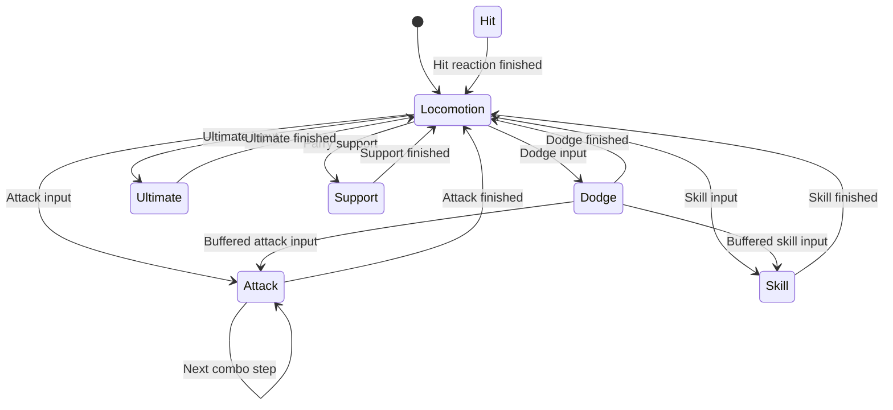

# 전투 코드 구조

## 주요 클래스의 역할

| 클래스 | 역할 |
| --- | --- |
| `PlayerController` | 입력 전달, 상태 전이, 체력·에너지·데시벨 관리 |
| `IPlayerState` 구현 | 행동별 진입·갱신·종료 처리, 입력 허용 시점과 취소 조건 |
| `AttackData` / `SkillData` / `UltimateData` | 애니메이션, 타격 구간, 이동과 공격 속성 설정 |
| `HitBox` / `HurtBox` | 충돌한 대상에 런타임 피격 데이터 전달 |
| `WeaponSweepDetector` | 프레임 사이 무기 이동 경로 검사, 활성 구간 내 중복 적중 방지 |
| `EnemyController` | 패턴 선택, 공격 진행, 피해·그로기·속성 이상 처리 |
| `PartyManager` / `SupportPointManager` | 파티 교대, 지원 종류 선택과 지원 포인트 관리 |
| `AssaultBattleController` | 전투 시작·종료, 제한 시간, 점수와 최종 결과 관리 |
| HUD 컴포넌트 | 전투 상태를 읽어 게이지·숫자·초상화·선택 화면 갱신 |

## 플레이어 상태 전이

`PlayerController.ChangeState()`에서 기존 상태의 `Exit()`를 호출한 뒤 새 상태의 `Enter()`를 호출합니다. 입력은 현재 상태의 `Handle...()` 메서드로 전달됩니다.

아래는 주요 전이를 요약한 그림입니다. 피격·교대·궁극기 등 모든 전이 조건을 나열한 것은 아닙니다.

극한 회피 뒤에는 입력과 취소 허용 시점에 따라 일반 공격 또는 스킬로 전환합니다. 이 경로를 별도의 회피 반격 전용 상태로 구현한 것은 아닙니다.

## 공격 설정과 피격 데이터

- `HitPayload`: 공격 데이터에 저장하는 배율·속성 등 정적 설정
- `CombatHitData`: 실제 공격자와 공격 속성을 담아 전달하는 런타임 값
- `HitWindow`: 애니메이션에서 타격 판정을 활성화할 시간 구간

행동 상태에서 `CombatHitData`를 생성해 `HitBox`에 전달합니다. 충돌한 `HurtBox`가 플레이어인지 적인지 구분한 뒤 해당 컨트롤러의 피격 처리를 호출합니다.

적의 무기 공격은 `BodyBox` 또는 `WeaponSweep` 판정을 사용합니다. `WeaponSweepDetector`는 이전·현재 프레임의 무기 샘플 지점을 검사하며, 결과 배열을 재사용하고 `HashSet<Transform>`으로 활성 구간 내 중복 적중을 막습니다.

## 패턴 선택과 그로기

`EnemyController`는 거리, 패턴별 재사용 가능 시각과 직전 패턴을 고려해 가중치로 공격을 선택합니다. 재사용 가능 시각은 `Dictionary<EnemyAttackData, float>`에 보관합니다.

패링 지원은 적의 공격을 중단하고 그로기를 누적합니다. 그로기 중 콤보 선택 요청은 `ChainSkillRequested` 이벤트로 전달됩니다.

- 콤보 선택 대기 중에는 그로기 시간이 정지합니다.
- 선택이 끝나 스킬이 실행되는 동안에는 그로기 시간이 흐릅니다.
- 마지막 콤보를 시작해 사용 가능 횟수가 소진되면 HUD가 회색 상태로 전환됩니다.

`ChainSkillPromptUI`는 선택 화면과 제한 시간을 표시하고, 선택·취소 결과를 전투 컨트롤러에 전달합니다. 그로기 수치와 콤보 가능 횟수의 관리는 `EnemyController`가 맡습니다.

## HUD와 연출

| 코드 | 표시 및 처리 대상 |
| --- | --- |
| `PlayerPartyHudAssemblyPresenter` | 파티 초상화와 플레이어 상태 |
| `CombatActionHUD` | 공격·회피·스킬·지원·궁극기 버튼 |
| `BossHudV8Presenter` | 상단 보스 체력·그로기·숫자 |
| `EnemyWorldStatusUI` | 적 위 체력·그로기·이상 축적 표시 |
| `DecibelHudText` | 데시벨 수치, PTS와 구간별 색상 |
| `AssaultTimerV1Presenter` / `AssaultScoreboardV1Presenter` | 강습전 시간과 점수 |
| `ZZZWipeoutLayeredDirector` | 전투 종료 시 와이프아웃 화면 연출 |

체력 잔상이나 색상 변화처럼 표시에 필요한 값은 HUD에서 따로 보관합니다. 화면에서 입력한 선택은 전투 시스템의 메서드로 전달하며, 피해 계산이나 그로기 진행 규칙을 HUD에 중복 구현하지 않습니다.

## 제작 도구와 공개 범위

`Assets/Editor/`에는 캐릭터 구성, 공격 타이밍 편집, HUD 제작과 빌드 보조 코드가 있습니다. 전투 타이밍 도구의 편집 범위는 [사용 안내](CombatEditor.md)에 정리했습니다.

`Assets/Shaders/`에는 프로젝트의 UI 및 화면 연출용 셰이더 소스와 캐릭터 툰 셰이더 소스를 담았습니다. 코드가 입력으로 사용하는 모델·이미지·영상, 생성되는 머티리얼·프리팹은 포함하지 않습니다.
