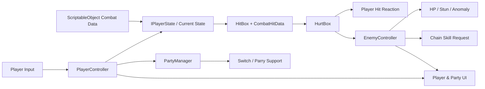

# Real-time Action Combat Structure Design

Unity로 제작 중인 3인 파티 기반 실시간 액션 전투 시스템의 **소스 코드 포트폴리오**입니다.

캐릭터 상태 전이, 데이터 기반 공격, 충돌 판정, 파티 교대, 패링 지원, 적의 그로기·이상 축적과 전투 UI를 서로 분리된 책임으로 구성하는 데 집중했습니다.

> 🎬 플레이 영상: 포트폴리오 영상 완성 후 링크를 추가할 예정입니다.

## 구현 목표

- 입력과 행동 규칙을 분리하는 플레이어 FSM
- 애니메이션 시간에 맞춘 다단 HitBox 판정
- 정적 공격 설정과 런타임 공격자 정보를 분리한 대미지 전달
- 캐릭터 데이터 교체만으로 공격·스킬·궁극기 구성을 바꾸는 구조
- 파티 교대, 패링 지원, 지원 포인트 흐름
- 적의 체력, 그로기, 속성 이상 축적과 연쇄 스킬 요청
- 런타임 전투 코드와 UI 표현 코드의 분리
- 반복적인 캐릭터·HUD 구성을 줄이는 Unity Editor 자동화

## 핵심 구조

자세한 책임과 호출 흐름은 [Architecture](Docs/Architecture.md)에서 확인할 수 있습니다.

## 주요 코드

| 영역 | 역할 | 대표 코드 |
| --- | --- | --- |
| Player FSM | 이동, 공격, 회피, 스킬, 궁극기, 지원 상태 전이 | `Assets/Scripts/Controllers/State` |
| Combat | HitBox/HurtBox 충돌과 런타임 피격 데이터 전달 | `Assets/Scripts/Battle` |
| Combat Data | 공격·스킬·궁극기·캐릭터 설정의 데이터화 | `Assets/Scripts/Battle/Data` |
| Enemy | 공격 경고, 피격, 그로기, 이상 축적 | `Assets/Scripts/Controllers/Enemy` |
| Party | 활성 캐릭터 교대와 패링 지원 자원 관리 | `PartyManager.cs`, `SupportPointManager.cs` |
| Camera | 추적, 충돌 보정, 줌, 화면 흔들림 | `Assets/Scripts/Camera` |
| UI | 체력·에너지·그로기·이상·연쇄 스킬 표시 | `Assets/Scripts/UI` |
| Editor Tools | 캐릭터 프리팹·데이터·HUD 구성 자동화 | `Assets/Editor` |

## 설계 포인트

### 1. 상태가 행동을 소유한다

`PlayerController`는 현재 상태를 보유하고 입력을 전달합니다. 이동, 공격, 회피, 스킬, 궁극기 로직은 각각의 `IPlayerState` 구현이 담당하므로 한 컨트롤러에 조건문이 집중되지 않습니다.

### 2. 설정 데이터와 충돌 순간 데이터를 분리한다

`HitPayload`는 배율과 판정 속성처럼 재사용 가능한 정적 설정을 보유합니다. 공격이 시작되면 실제 공격자와 결합해 `CombatHitData`가 되고, `HitBox → HurtBox` 흐름을 통해 피격 대상까지 전달됩니다.

### 3. UI는 전투 규칙을 변경하지 않는다

UI는 `PlayerController`, `PartyManager`, `EnemyController`의 공개 상태를 읽거나 명시적으로 바인딩됩니다. 체력바의 지연 감소처럼 표현에만 필요한 동작은 `AnimatedGaugeUI`가 독립적으로 처리합니다.

### 4. 반복 작업은 Editor 도구로 자동화한다

캐릭터 프리팹과 데이터 팩 생성, 임포트 설정, HUD 프리팹 구성을 Editor 코드로 자동화해 수동 연결 실수를 줄였습니다.

## 개발 과정

이 저장소에는 기본 이동·공격 구현부터 FSM, 데이터 기반 콤보, 스킬·궁극기, 패링 지원, 파티 교대와 에디터 자동화로 확장한 코드 커밋 기록이 남아 있습니다.

단계별 변화는 [Development History](Docs/DevelopmentHistory.md)에 정리했습니다.

## 저장소 공개 범위

이 저장소는 코드 검토를 위한 포트폴리오 저장소이며 **독립 실행 가능한 Unity 프로젝트가 아닙니다.**

- 포함: 직접 작성한 C# 런타임 코드, Editor 도구, 설계 문서
- 제외: 모델, 애니메이션, 텍스처, 음원, 영상, 프리팹, 씬, ScriptableObject 인스턴스, 외부 플러그인
- 과거 Git 기록도 동일한 기준으로 정리하여 바이너리 에셋을 포함하지 않습니다.

## Fan Project Notice

This is an unofficial, non-commercial fan-made combat system study inspired by *Zenless Zone Zero*. This repository does not distribute original game models, animations, textures, audio, video, or other proprietary assets. All rights to the referenced IP belong to their respective owners.

